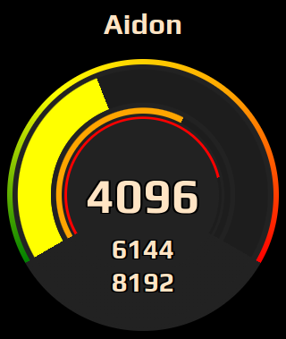

# Aidon ams han power meter

A Power meter for Aidon ams han. This project is just a visulizer for https://github.com/robinsmidsrod/ams-han-decoder.

Shows current hour avarage, last 5 min average and current watt.



# Installation
Clone this repository. And then use npm to install dependency packages.

```sh
npm install
```

Dependency list that will be automatically installed with the command above:
```sh
npm install ws
npm install mqtt
npm install ini
npm install cli-color
```

# Configuration
Copy `config.example.ini` to `config.ini` and edit values to your preferences.

## Set application title
This is the title used in the browser tab, and on the page.
```ini
title = "Aidon"
```

## Guage colours and limits
* `peak`: The maximum value for the guage.
* `green`: The bar will remain green colour until this value.
* `yellow`: The bar will remain yellow colour until this value.
* `orange`: The bar will remain orange colour until this value.

Values above orange will be red.
```ini
[watt]
peak = 10000
green = 3000
yellow = 5000
orange = 7000
```

## AMS mqtt broker
The address for the AMS mqtt broker.
```ini
[mqtt]
read = "mqtt://192.168.1.10:1883"
```

## AMS mqtt broker
* `interface`: The interface address to run the webserver on.
* `www_port`: The port to run the webserver on.
* `ws_port`: The port to run the websocket on.
```ini
[server]
interface = "192.168.1.10"
www_port = 8302
ws_port = 8303
```

## Proxy
If you wish to run the application behind a proxy, it will need to know the address to connect the websocket.
```ini
[proxy]
ws = "wss://example.com/socket"
```
